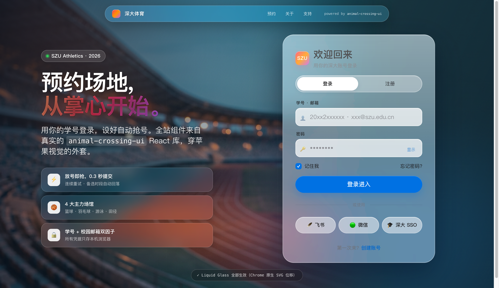
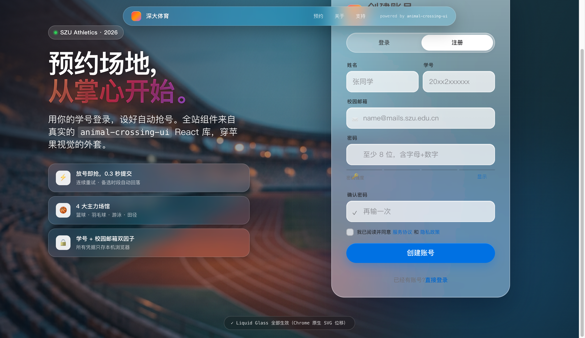
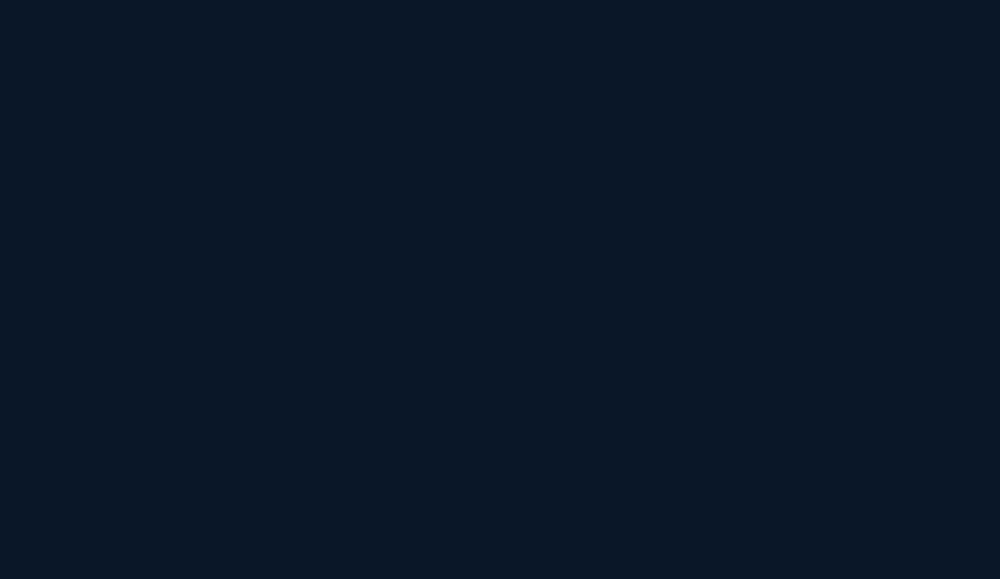

# SZU Auth · 深圳大学体育馆预约登录/注册

animal-crossing-ui 真实组件 + Apple 设计语言 + Liquid Glass 液态玻璃。





## 技术栈

- React 18 + Vite 5
- [animal-crossing-ui](https://www.npmjs.com/package/animal-crossing-ui) `^0.1.1`（源自 `inkyMountain/gradience`）
- SVG `feDisplacementMap` + `backdrop-filter` 液态玻璃
- `crypto.subtle.digest` SHA-256 密码哈希
- localStorage 会话持久化

## 运行

```bash
npm install
npm run dev
```

打开 http://127.0.0.1:5174

## 功能

- **登录**：学号/邮箱 + 密码，错误次数锁定 5 分钟
- **注册**：姓名、学号（`20\d{2}2\d{6}`）、校园邮箱（`@(mails\.)?szu\.edu\.cn`）、密码强度条、同意条款
- **忘记密码**：`animal-crossing-ui` 的 `<Dialog>` 弹出邮箱重置
- **背景**：深大运动场照片 + 深色渐变遮罩保可读性

## 踩过的坑（给后续集成者）

### 1. `Input` 没从主入口导出

`animal-crossing-ui` 的 `index.d.ts` 只导出 `Icon, Button, Dialog, Layout`，但 `dist/lib/input` 确实存在：

```jsx
import { Button, Dialog, Layout } from 'animal-crossing-ui';
import Input from 'animal-crossing-ui/dist/lib/input'; // 深导入
```

### 2. Button `colortype` 只认 6 个值

合法值：`red | orange | yellow | green | blue | khaki`。传 `"primary"` 会炸 `Cannot read properties of undefined (reading 'length')`——组件内部 `getRandomColor` 回退失败。

```jsx
<Button colortype="blue">登录</Button>
```

### 3. Button 用内联 style 污染，CSS 必须 `!important`

组件内部 `style={{backgroundImage, border}}` 直接注入元素，普通 class 压不过。Apple Skin 里全部 `!important`：

```css
.gui-button {
  background: var(--color-action) !important;
  background-image: none !important;
  border: 0 !important;
  border-radius: var(--radius-pill) !important;
}
```

### 4. Liquid Glass 仅 Chrome 支持 SVG filter in `backdrop-filter`

`@supports` 做渐进增强，其他浏览器退化为纯 `blur + saturate`：

```css
.glass-card { backdrop-filter: blur(32px) saturate(200%); }
@supports (backdrop-filter: url(#a)) {
  .glass-card { backdrop-filter: blur(32px) saturate(200%) url(#liquid-glass); }
}
```

SVG filter 定义在 `index.html` 的隐藏 `<svg>` 里，`feTurbulence` → `feGaussianBlur` → `feDisplacementMap`，模拟 Snell 折射。

## 目录

```
src/
├── App.jsx              # 登录/注册/找回密码三态
├── main.jsx
└── styles/
    └── apple-skin.css   # 覆盖 .gui-* 为 Apple 视觉
public/
└── stadium-bg.jpg       # 运动场背景
index.html               # 含 <filter id="liquid-glass">
```

## License

MIT
